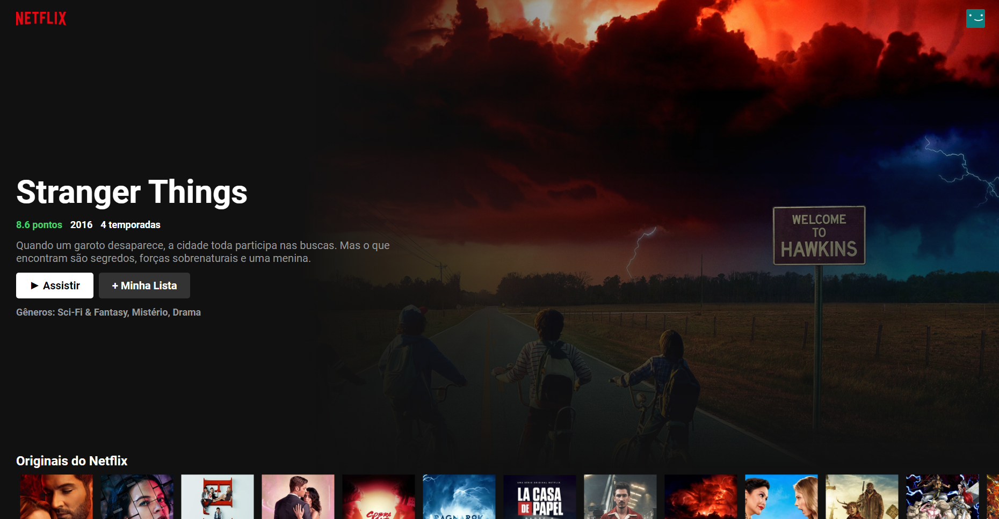

# Como rodar o projeto

Para rodar o projeto, você primeiramente precisa rodar o comando `yarn install` ou `npm install` em seu terminal. Em seguda, você precisará de uma Api Key do site tmdb.org. Para consegui-la, você deve acessar [este](https://www.themoviedb.org/settings/api) endereço de url e gerar uma chave própria.

## Gerei uma chave de API própria. E agora?

Ao ter acesso a sua chave da API v3, você deve criar um arquivo chamado `.env.local` na raíz do diretório do projeto e preenchê-lo da seguinte forma:

### `REACT_APP_API_KEY="Sua chave de api v3 aqui"`
### `REACT_APP_API_BASE="https://api.themoviedb.org/3"`

Ao criar tal arquivo, você estará apto a rodar a aplicação com o comando `yarn start` ou `npm start`.

## Preview da página

